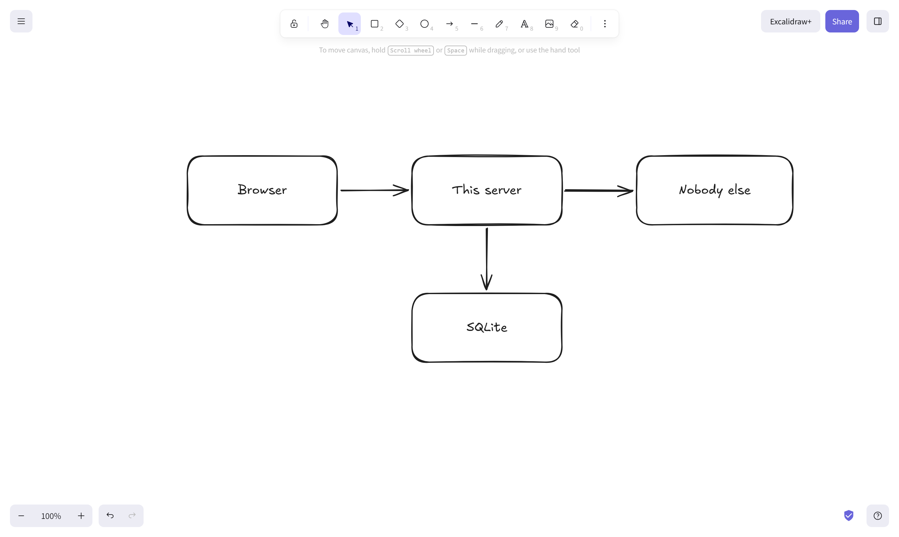
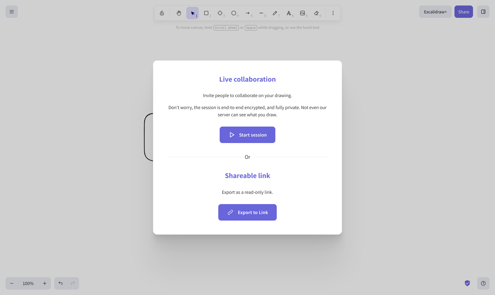

<p align="center">
  <picture>
    <source media="(prefers-color-scheme: dark)" srcset="https://raw.githubusercontent.com/junkerderprovinz/excalidraw/main/.github/assets/excalidraw-banner-dark.png">
    
  </picture>
</p>

<p align="center">
  <a href="https://github.com/junkerderprovinz/excalidraw/actions/workflows/build.yml"></a>&nbsp;
  <a href="https://github.com/junkerderprovinz/excalidraw/actions/workflows/lint.yml"></a>&nbsp;
  <a href="https://hub.docker.com/r/junkerderprovinz/excalidraw"></a>&nbsp;
  <a href="https://hub.docker.com/r/junkerderprovinz/excalidraw"></a>&nbsp;
  <a href="https://github.com/junkerderprovinz/excalidraw/pkgs/container/excalidraw"></a>&nbsp;
  <a href="https://go.dev"></a>&nbsp;
  <a href="https://nginx.org"></a>&nbsp;
  <a href="https://unraid.net"></a>&nbsp;
  <a href="LICENSE"></a>
</p>

<br>

<p align="center">
<a href="https://excalidraw.com"><b>Excalidraw</b></a> is a virtual whiteboard for sketches that look
hand-drawn. This is a self-hosted build of it that <b>keeps to itself</b>: shared links, live
collaboration, the session scene, the fonts and the icons all come from your own server, and the
browser never contacts anyone else. One container, one port, nothing to configure.
</p>

<br>

<p align="center">
One knight's job: I build it, keep it running, work through the issues and add what people ask for, until nothing is missing. No accounts, no telemetry, no ads. No trial, no tier, no asterisk. Nothing readable ever leaves your own walls.
</p>

<p align="center">
If it has earned a place on your computer or server, a donation covers what it costs: the domain, the server, and the evenings that go into it. It also makes this knight's heart beat a little faster. Three ways below, whichever suits you.
</p>

<br>

<p align="center">
  <a href="https://buymeacoffee.com/junkerderprovinz"></a>
  &nbsp;
  <a href="https://paypal.me/hallelujadesign"></a>
  &nbsp;
  <a href="https://junkerderprovinz.github.io/junkerderprovinz/"></a>
</p>

<br>

## Table of Contents

1. [What is this?](#1-what-is-this)
2. [Screenshots](#2-screenshots)
3. [What it keeps off the internet](#3-what-it-keeps-off-the-internet)
4. [How it is built](#4-how-it-is-built)
5. [Quick Start on Unraid](#5-quick-start-on-unraid)
6. [Configuration](#6-configuration)
7. [Reverse Proxy](#7-reverse-proxy)
8. [Building it yourself](#8-building-it-yourself)
9. [Updating Excalidraw](#9-updating-excalidraw)
10. [License](#10-license)
11. [Support this project](#11-support-this-project)

<br>

## 1. What is this?

Excalidraw is excellent, and the published image of it is a plain web server with the app inside.
What that image does not tell you is how much of the app still talks to Excalidraw's own
infrastructure: a shared link is stored on their server, a live session keeps its scene in Google
Firestore, the fonts come from a CDN, and an analytics script loads on every visit.

None of that is a criticism of the project. It is how a free hosted service pays for itself, and
all of it is configurable at BUILD time, which is precisely why the published image cannot offer
it as a setting.

This image is that build, done differently. Everything above points back at the container, and a
gate in the build refuses to produce an image where any of it still points outward.

<br>

## 2. Screenshots

<p align="center">
  
  <br><em>The whiteboard itself, unchanged: this is Excalidraw, drawing the way it always does.</em>
</p>

<p align="center">
  
  <br><em>Both of these now run on your server. The session is end-to-end encrypted, and the key never leaves the link.</em>
</p>

<br>

## 3. What it keeps off the internet

| What | Upstream | Here |
| --- | --- | --- |
| Shared links | `json.excalidraw.com` | this container, in SQLite |
| Live session scene | Google Firestore | this container, in SQLite |
| Pasted images | Firebase Storage | this container, in SQLite |
| Collaboration socket | `oss-collab.excalidraw.com` | this container |
| Fonts | a CDN | this container |
| Analytics | `simpleanalyticscdn.com` | removed |
| Shape library | `libraries.excalidraw.com` | off by default, switch below |
| Text to diagram | `oss-ai.excalidraw.com` | off by default, switch below |

The last two are real features rather than telemetry, so they are switches instead of a decision
made for you. Off means the request never leaves your server; the feature reports an error rather
than pretending to work.

Everything a drawing contains is encrypted in your browser before it is stored, with the key in
the part of the link after the `#`, which browsers never send to a server. The container holds
bytes it cannot read.

<br>

## 4. How it is built

Three processes behind one nginx:

- **The app**, built from a pinned Excalidraw commit with one file replaced, the one that talks to
  Firestore. Same encryption, same merge logic when two people draw at once, different destination.
- **The store**, a small Go binary over SQLite, serving the scene, room and file endpoints the app
  expects. The usual self-hosted store is a Node service whose published image has not been rebuilt
  since February 2022; this one is built here and tested here.
- **The room server**, Excalidraw's own relay. It forwards messages between browsers and stores
  nothing, which is why the store exists.

The addresses in the app are relative paths, not an absolute URL built from a variable you have to
set. Your browser resolves them against whatever address you opened, so the same image works on a
LAN IP, behind a reverse proxy and under a subdomain with nothing to configure.

<br>

## 5. Quick Start on Unraid

Search for **excalidraw** in Community Applications, or add the container by hand:

```bash
docker run -d \
  --name excalidraw \
  -p 8080:80 \
  -p 8443:443 \
  -v /mnt/user/appdata/excalidraw:/config \
  --restart unless-stopped \
  ghcr.io/junkerderprovinz/excalidraw:latest
```

Then open **https://your-server:8443**.

**Use the HTTPS port.** Live collaboration needs `crypto.subtle`, which browsers only provide in a
secure context, so over plain HTTP the session button fails with a cryptography error. The
container generates a self-signed certificate on first start and keeps it in `/config`, so your
browser only has to be told once. The HTTP port stays for the single-user case where no session is
ever started.

<br>

## 6. Configuration

| Variable | Default | What it does |
| --- | --- | --- |
| `ENABLE_LIBRARY` | `false` | Set to `true` to let the shape library load from `libraries.excalidraw.com`. |
| `ENABLE_AI` | `false` | Set to `true` to let the text-to-diagram feature send your text to `oss-ai.excalidraw.com`. |
| `STORE_DB` | `/config/store.sqlite` | Where drawings, rooms and images are kept. |
| `TZ` | `Etc/UTC` | Time zone for the log. |

`/config` holds the database and the certificate. Back it up and you have backed up everything.

<br>

## 7. Reverse Proxy

Point your proxy at port **80** of the container and let it terminate TLS. The app only ever uses
relative paths, so nothing needs to know its own address. Two things the proxy has to allow:

- **WebSocket upgrades** on `/socket.io/`, or live collaboration cannot connect.
- **A body size** large enough for a drawing with images, 64 MB matches what the container accepts.

<br>

## 8. Building it yourself

```bash
git clone https://github.com/junkerderprovinz/excalidraw.git
cd excalidraw
docker build -t excalidraw .
```

The build takes a while, because it compiles Excalidraw from source. The last step is the gate: it
searches the finished app for every address that should be gone and fails the build if it finds
one, so an image that calls home cannot be produced by accident.

The Go store has its own tests:

```bash
cd backend && go test ./...
```

<br>

## 9. Updating Excalidraw

The upstream commit is pinned in the `Dockerfile` as `EXCALIDRAW_SHA`, deliberately, so the image
does not change under you. To move it forward, set the new commit and rebuild. If the replaced file
has changed upstream, the build fails at the TypeScript step rather than silently shipping a broken
whiteboard, and the gate independently checks that the two switchable addresses are still where the
runtime expects them.

<br>

## 10. License

This repository is licensed under **AGPL-3.0** (see [LICENSE](LICENSE)).

Excalidraw itself is [MIT-licensed](https://github.com/excalidraw/excalidraw/blob/master/LICENSE)
and belongs to the Excalidraw team. The two replaced files in `frontend/` are derived from theirs
and say so in their headers. This project is not affiliated with or endorsed by Excalidraw.

<br>

## 11. Support this project

Questions via the support thread, bugs, ideas and feature requests via [GitHub issues](https://github.com/junkerderprovinz/excalidraw/issues).

One knight's job: I build it, keep it running, work through the issues and add what people ask for, until nothing is missing. No accounts, no telemetry, no ads. No trial, no tier, no asterisk. Nothing readable ever leaves your own walls.

If it has earned a place on your computer or server, a donation covers what it costs: the domain, the server, and the evenings that go into it. It also makes this knight's heart beat a little faster. Three ways below, whichever suits you.

<p align="center">
  <a href="https://buymeacoffee.com/junkerderprovinz"></a>
  &nbsp;
  <a href="https://paypal.me/hallelujadesign"></a>
  &nbsp;
  <a href="https://junkerderprovinz.github.io/junkerderprovinz/"></a>
</p>
