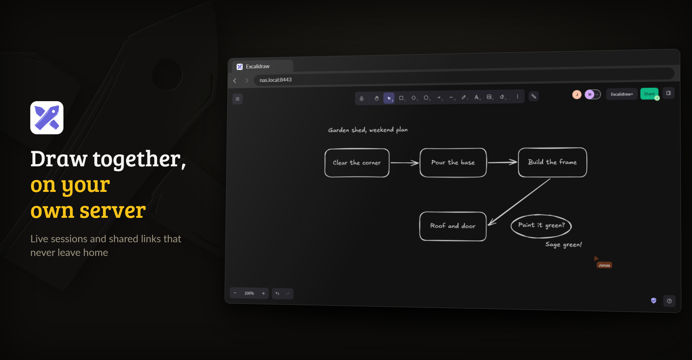
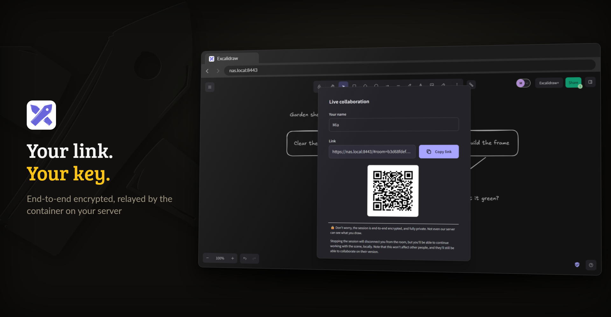

<p align="center">
  <picture>
    <source media="(prefers-color-scheme: dark)" srcset="https://raw.githubusercontent.com/junkerderprovinz/excalidraw/main/.github/assets/excalidraw-banner-dark.png">
    
  </picture>
</p>

<p align="center">
  <a href="https://github.com/junkerderprovinz/excalidraw/actions/workflows/build.yml"></a>&nbsp;
  <a href="https://github.com/junkerderprovinz/excalidraw/actions/workflows/lint.yml"></a>&nbsp;
  <a href="https://hub.docker.com/r/junkerderprovinz/excalidraw"></a>&nbsp;
  <a href="https://hub.docker.com/r/junkerderprovinz/excalidraw"></a>&nbsp;
  <a href="https://github.com/junkerderprovinz/excalidraw/pkgs/container/excalidraw"></a>&nbsp;
  <a href="https://go.dev"></a>&nbsp;
  <a href="https://nginx.org"></a>&nbsp;
  <a href="https://ca.unraid.net/apps/excalidraw-12jk2zv0fttlyf"></a>&nbsp;
  <a href="LICENSE"></a>
</p>

<br>

<p align="center">
<a href="https://excalidraw.com"><b>Excalidraw</b></a> is a virtual whiteboard for sketches that look
hand-drawn. This is a self-hosted build of it that <b>keeps to itself</b>: shared links, live
collaboration, the session scene, the fonts and the icons all come from your own server, and the
browser never contacts anyone else. One container, one port, nothing to configure.
</p>

<!-- download-buttons: written by scripts/gen_download_buttons.py -->
<p align="center">
  <a href="https://ca.unraid.net/apps/excalidraw-12jk2zv0fttlyf"></a>
  &nbsp;
  <a href="https://hub.docker.com/r/junkerderprovinz/excalidraw/"></a>
  &nbsp;
  <a href="https://github.com/junkerderprovinz/excalidraw/releases/latest"></a>
</p>
<!-- /download-buttons -->

<br>

<p align="center">
A one-knight job: I build it, keep it running, work through the issues and add what people ask for, until nothing is missing. It is free, with no accounts, no telemetry, no ads and no paid tier. No asterisk anywhere. Nothing readable ever leaves your own walls. Forged on evenings and weekends, with heart and stubbornness.
</p>

<p align="center">
If it has earned a place on your server or computer, toss a coin to your knight: it helps cover the costs and keeps the project alive. It also makes this knight's heart beat a little faster. Three ways below, whichever suits you.
</p>

<!-- give-buttons: written by scripts/gen_download_buttons.py -->
<p align="center">
  <a href="https://buymeacoffee.com/junkerderprovinz"></a>
  &nbsp;
  <a href="https://www.paypal.com/donate/?hosted_button_id=76FVV52TKXTUS"></a>
  &nbsp;
  <a href="https://junkerderprovinz.github.io/junkerderprovinz/"></a>
</p>
<!-- /give-buttons -->

<br>

## Table of Contents

1. [What it looks like](#1-what-it-looks-like)
2. [What it does](#2-what-it-does)
3. [How it compares](#3-how-it-compares)
4. [Getting started](#4-getting-started)
5. [How AI is used here](#5-how-ai-is-used-here)
6. [Support this project](#6-support-this-project)

<br>

## 1. What it looks like

The drawing and the names in these pictures are made up.

<p align="center">
  
  <br><em>A live session, relayed and stored by the container on your server</em>
</p>

<p align="center">
  
  <br><em>The session link points at your server, and the key in it never reaches any server</em>
</p>

<br>

## 2. What it does

- **The same Excalidraw.** Built from a pinned upstream commit, with one file replaced: the one that talks to Firestore. The encryption and the merge logic for two people drawing at once are unchanged.
- **Shared links and live sessions stay home.** A small Go store over SQLite keeps scenes, rooms and pasted images, and Excalidraw's own room server relays between browsers.
- **Nothing calls out.** The fonts come from the image and the analytics script is gone. A gate at the end of the build fails if any outside address is left in the app.
- **Two features are switches.** The shape library (`ENABLE_LIBRARY`) and text to diagram (`ENABLE_AI`) would contact Excalidraw's servers, so they are off until you turn them on.
- **HTTPS from the first start.** Live collaboration needs a secure context, so the container makes a self-signed certificate and keeps it in `/config`.
- **Nothing to configure.** The app only uses relative paths, so the same image works on a LAN address, behind a reverse proxy and under a subdomain.

<br>

## 3. How it compares

The published Excalidraw image runs the app unchanged, and the app still talks to Excalidraw's own infrastructure. That is how a free hosted service pays for itself, and it is all decided when the app is built, which is why the published image cannot offer it as a setting.

| What | Upstream | Here |
| --- | --- | --- |
| Shared links | `json.excalidraw.com` | this container, in SQLite |
| Live session scene | Google Firestore | this container, in SQLite |
| Pasted images | Firebase Storage | this container, in SQLite |
| Collaboration socket | `oss-collab.excalidraw.com` | this container |
| Fonts | a CDN | this container |
| Analytics | `simpleanalyticscdn.com` | removed |
| Shape library | `libraries.excalidraw.com` | off by default, `ENABLE_LIBRARY` |
| Text to diagram | `oss-ai.excalidraw.com` | off by default, `ENABLE_AI` |

Everything a drawing contains is encrypted in your browser before it is stored. The key sits in the part of the link after the `#`, which browsers never send to a server, so the container holds bytes it cannot read.

<br>

## 4. Getting started

On Unraid, install **Excalidraw** from [Community Applications](https://ca.unraid.net/apps/excalidraw-12jk2zv0fttlyf). Anywhere else:

```bash
docker run -d --name excalidraw   -p 8443:443   -v /path/to/config:/config   --restart unless-stopped   ghcr.io/junkerderprovinz/excalidraw:latest
```

Then open `https://your-server:8443` and accept the certificate once. Use the HTTPS port: over plain HTTP the browser withholds the cryptography a live session needs, and starting one fails. `/config` holds the database and the certificate, so backing it up backs up everything.

Behind a reverse proxy, point it at port 80 of the container, allow WebSocket upgrades on `/socket.io/` and a body size of 64 MB.

<br>

## 5. How AI is used here

One knight builds this, and AI is one of the tools I work with, the same way I work with an editor or a compiler. It helps me write code and documentation and it checks my work, and that saves me a good many evenings. It does not make the decisions, though. I read and understand everything before it ships, and if something here breaks, that is on me and not on the tool.

You do not have to take my word for it. The code is open and every release note is written by hand. The issue tracker shows how problems actually get handled, including the ones I got wrong the first time. If you find something that is not right, open an issue and I will look at it.

<br>

## 6. Support this project

Questions via the [support thread](https://forums.unraid.net/topic/198811-support-junkerderprovinz-unraid-apps/), bugs, ideas and feature requests via [GitHub issues](https://github.com/junkerderprovinz/excalidraw/issues).

A one-knight job: I build it, keep it running, work through the issues and add what people ask for, until nothing is missing. It is free, with no accounts, no telemetry, no ads and no paid tier. No asterisk anywhere. Nothing readable ever leaves your own walls. Forged on evenings and weekends, with heart and stubbornness.

If it has earned a place on your server or computer, toss a coin to your knight: it helps cover the costs and keeps the project alive. It also makes this knight's heart beat a little faster. Three ways below, whichever suits you.

<!-- give-buttons: written by scripts/gen_download_buttons.py -->
<p align="center">
  <a href="https://buymeacoffee.com/junkerderprovinz"></a>
  &nbsp;
  <a href="https://www.paypal.com/donate/?hosted_button_id=76FVV52TKXTUS"></a>
  &nbsp;
  <a href="https://junkerderprovinz.github.io/junkerderprovinz/"></a>
</p>
<!-- /give-buttons -->

<br>

<sub>Excalidraw is [MIT-licensed](https://github.com/excalidraw/excalidraw/blob/master/LICENSE) and belongs to the Excalidraw team. This image is not affiliated with or endorsed by Excalidraw.</sub>
